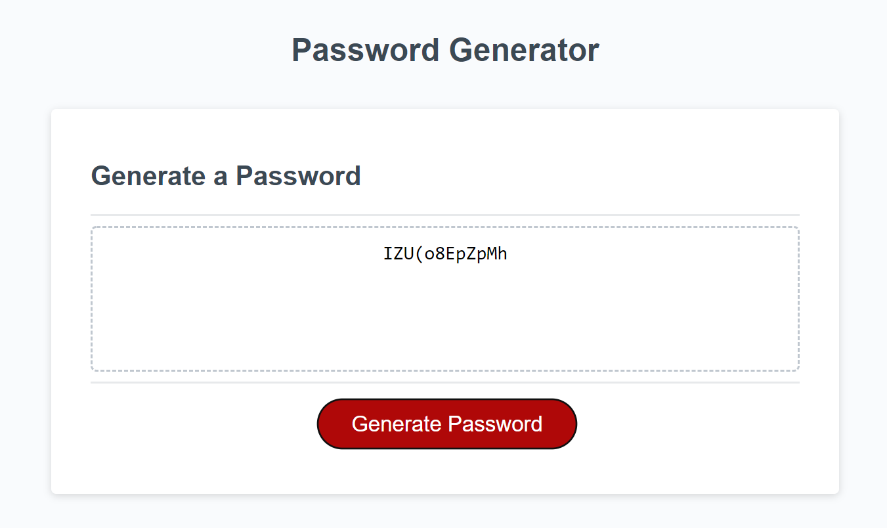

# Password-Generator
[Deployed Application](https://kwlucas.github.io/Password-Generator/)
## Purpose

This web application serves to randomly generate a password that meets selected criteria.

## Functionality

* The length of the password can be set to any number between 8 and 128.

* The password can be set to include lowercase letters.

* The password can be set to include uppercase letters.

* The password can be set to include digits.

* The password can be set to include special characters. 

* Entering invalid or no criteria will prompt the user to try again.

* The generated password meeting all criteria will be displayed on the page.

## Application Preview

Here is a preview of the web application after generating a password.

